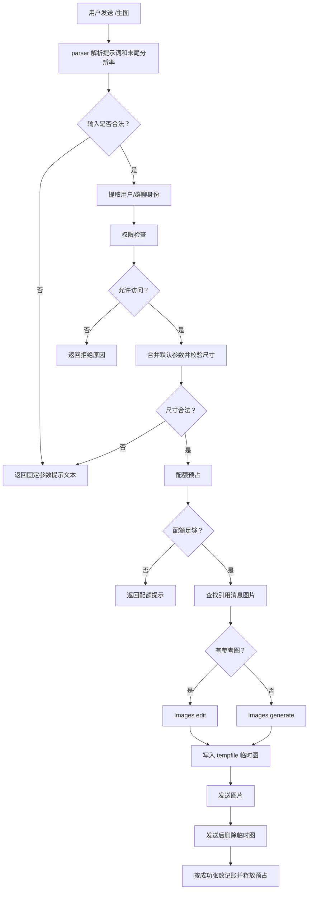

# 架构文档

本文件按当前真实实现描述插件边界、模块职责、主流程、数据流和架构取舍。插件定位是 AstrBot 生图命令插件：用户发送触发词、提示词和可选分辨率，插件执行访问控制、配额检查、引用图提取、OpenAI-compatible 生图调用和结果发送。

## 一、整体框架

### 1.1 系统概述

本项目是一个独立 AstrBot 插件。插件监听 `/gimg`、`/生图`、`/画图` 命令，解析用户输入中的提示词和末尾分辨率；如果当前消息回复/引用了含图片消息，则提取引用消息里的全部图片作为参考图；否则执行纯文本生图。

插件当前固定用户交互契约：

```text
生图 <提示词> <分辨率>
```

其中分辨率可省略，支持：

```text
1536x1024
1536*1024
1536×1024
auto
```

模型、背景和输出格式固定为 `gpt-image-2`、`opaque` 和 `png`。其他生图参数不从聊天消息解析，而由插件配置和默认值控制：

| 参数 | 默认值 |
| --- | --- |
| 模型 | `gpt-image-2` |
| 尺寸选项 | `auto` |
| 自定义分辨率 | `1024x1024` |
| 质量 | `high` |
| 背景 | `opaque` |
| 输出格式 | `png` |
| 张数 | `1` |

### 1.2 核心模块结构

```text
astrbot_plugin_gpt_image/
├── main.py                 # AstrBot 插件入口/出口适配层
├── _conf_schema.json       # AstrBot WebUI 配置 schema
├── metadata.yaml           # 插件元信息
├── requirements.txt        # 运行依赖
├── README.md               # 安装、配置和使用说明
├── docs/
│   └── ARCHITECTURE.md     # 当前架构文档
└── core/
    ├── __init__.py         # core 包导出边界
    ├── constants.py        # 插件名、命令名、固定提示文案和图片 MIME 常量
    ├── config.py           # 默认配置、配置合并、基础类型解析
    ├── errors.py           # 可安全展示给用户的错误类型
    ├── service.py          # 生图/额度查询业务编排，输出 TextReply/ImageReply
    ├── command/
    │   ├── parser.py       # 用户命令解析：提示词 + 可选末尾分辨率
    │   └── options.py      # 生图参数归一化和尺寸约束校验
    ├── policy/
    │   ├── access.py       # 管理员/黑白名单访问控制
    │   ├── identity.py     # 从 AstrBot 事件提取身份，计算配额作用域
    │   └── quota.py        # 群聊/私聊配额账本和预占释放机制
    ├── media/
    │   ├── references.py   # 引用消息图片提取、下载和临时文件管理
    │   └── image_generator.py # OpenAI-compatible 生图调用和生成图临时落盘
    └── storage/
        ├── paths.py        # 插件持久数据目录解析和初始化
        └── tempfiles.py    # 插件临时目录、临时图片创建和安全删除
```

### 1.3 核心契约

#### 用户输入契约

`core/command/parser.py` 只解析命令后的正文，不直接依赖 AstrBot 事件对象。解析结果是：

```python
ParsedCommand(
    prompt="...",
    options={"size": "1536x1024"},
    show_help=False,
)
```

如果没有合法末尾分辨率，整段正文都保留为提示词。这样可以避免把用户提示词里的“高质量”“两张海报”等词误判为参数。

#### 参数约束契约

`core/command/options.py` 负责将 `ParsedCommand.options` 与配置默认值合并为 `ImageOptions`。尺寸校验在发起模型请求前完成，非法尺寸不会进入 OpenAI-compatible 接口。

当前尺寸约束：

```text
单边最大 3840
宽高均为 16 的倍数
宽高比不超过 3:1
总像素在 655360 到 8294400 之间
```

默认尺寸由 `defaults.size_preset` 下拉控制，可选 `auto`、16:9 / 9:16 / 1:1 的 1K、2K、4K 常用尺寸和 `custom`。选择 `custom` 时读取 `defaults.custom_size`。

用户可见提示文案统一为：

```text
请选择合法参数（触发词、提示词、分辨率之间用空格分隔）
生图 <提示词> <分辨率>（分辨率支持 auto 或 长×宽 / 长*宽 / 长x宽，单边不超过 3840）
```

#### 配额契约

`core/policy/quota.py` 使用“请求前预占，成功后记账”的模型：

1. 请求开始前按作用域预占本次成本。
2. 请求进行中，预占量计入窗口限制。
3. 请求成功生成多少张，就记录多少张成功用量。
4. 请求失败或取消时释放预占，不增加成功用量。

配额作用域：

```text
私聊：按用户 ID
群聊：按群 ID
```

#### 访问控制契约

`core/policy/access.py` 只接受归一化后的 `AccessIdentity`，不读取 AstrBot 事件。配置字段为 `permissions`，权限优先级固定为：

```text
管理员 > 个人白名单 > 个人黑名单 > 群组白名单 > 群组黑名单
```

白名单启用但没有命中时，普通用户会被拒绝；白名单未启用时，未命中黑名单的普通用户默认放行。私聊只判断管理员、个人白名单和个人黑名单。

## 二、模块职责

### 2.1 主入口 `main.py`

`PreciseImagePlugin` 只负责 AstrBot 入口和出口：

* 注册 `/gimg`、`/生图`、`/画图` 命令。
* 初始化插件数据目录。
* 创建 `PreciseImageService`。
* 把 AstrBot 事件交给 service。
* 将 service 返回的 `TextReply` / `ImageReply` 转成 `event.plain_result()` / `event.image_result()`。
* 跟踪进行中的生图命令任务，插件终止时取消它们。
* 图片结果发送完成后删除对应临时文件。

`main.py` 不再直接解析命令、不做访问控制、不管理配额、不解析引用图、不调用模型、不落盘图片。它是薄适配层，负责把 AstrBot 的输入/输出和内部业务层连接起来。

### 2.2 业务编排模块 `core/service.py`

`core/service.py` 是插件的应用服务层，负责串起核心流程：

* 解析命令。
* 提取身份并检查黑白名单。
* 合并参数并校验尺寸。
* 预占配额。
* 提取和准备引用图。
* 调用 `ImageGenerator`。
* 按成功生成张数记账。
* 生成用户可见输出。

它不直接调用 AstrBot 的 `event.plain_result()` 或 `event.image_result()`，而是返回：

```python
TextReply(text="...")
ImageReply(path="...")
```

这样业务流程可以脱离 AstrBot 输出 API 单独演进，`main.py` 只负责把这些 reply 转成 AstrBot 消息结果。

### 2.3 配置模块 `core/config.py`

`core/config.py` 提供：

* `DEFAULT_CONFIG`：插件默认配置。
* `merge_config()`：将 AstrBot 配置覆盖到默认配置。
* `get_section()`：安全读取配置分组。
* `string_list()`、`bool_value()`、`int_value()`：配置类型归一化。

该模块不理解 AstrBot、OpenAI 或图片生成，只处理配置形状和值类型。

### 2.4 命令解析模块 `core/command/parser.py`

`core/command/parser.py` 只关心聊天文本格式：

```text
/生图 一个银白色机械鸟停在玻璃树枝上
/生图 一个银白色机械鸟停在玻璃树枝上 1536x1024
/生图 一个银白色机械鸟停在玻璃树枝上 1536*1024
/生图 一个银白色机械鸟停在玻璃树枝上 1536×1024
```

解析规则：

* 触发词必须在最前。
* 触发词、提示词、分辨率之间用空格分隔。
* 只有最后一个 token 能被识别为分辨率。
* 分辨率可以是 `auto` 或数字尺寸，数字尺寸分隔符统一归一为 `x`。
* `--size` 这类命令行写法直接判定为输入方式错误。
* 其他尾部词不作为参数，保留在提示词中。

这个模块当前拆分合理，因为它是低风险、高变动的交互边界，适合单独维护。

### 2.5 参数模块 `core/command/options.py`

`core/command/options.py` 负责业务参数：

* 解析和校验图片尺寸。
* 将尺寸下拉选项解析为 `auto`、预设尺寸或自定义尺寸。
* 校验质量和张数。
* 固定模型、背景、输出格式和参考图保真度相关请求行为。
* 生成最终 `ImageOptions`。

虽然当前用户只允许传分辨率，但保留参数归一化仍然合理，因为默认质量、默认张数和尺寸选项仍来自插件配置；同时它隔离了模型接口约束，避免 `main.py` 直接散落参数校验。

### 2.6 访问控制模块 `core/policy/access.py`

`core/policy/access.py` 是纯策略模块。它不关心消息内容，也不关心配额和模型调用。

输入：

```python
AccessIdentity(user_id="...", group_id="...", session_id="...", is_private=True)
```

输出：

```python
AccessDecision(allowed=True, reason="")
```

该模块拆分合理，因为管理员、白名单和黑名单策略独立、稳定，也便于以后接入管理员命令或外部配置来源。

### 2.7 身份模块 `core/policy/identity.py`

`core/policy/identity.py` 将 AstrBot 事件中的发送者、群号和会话标识归一化为 `AccessIdentity`，并根据私聊/群聊计算配额作用域。

它是轻量适配模块，隔离了 AstrBot 事件字段读取逻辑，避免 `service.py` 直接知道各种 sender/group/session 字段。

### 2.8 配额模块 `core/policy/quota.py`

`core/policy/quota.py` 负责持久用量账本和进行中请求预占：

* `QuotaLimit`：配置中的窗口分钟数和最大图片数。
* `QuotaLedger`：读取/写入 `usage.json`，维护进行中预占。
* `QuotaReservation`：请求生命周期句柄。
* `QuotaExceededError`：配额超限时的结构化错误。

当前用 JSON 文件保存成功用量，适合轻量插件。它不是审计级账本，也不适合多进程高并发共享；如果未来 AstrBot 以多进程运行同一插件，需要换成 SQLite 或带文件锁的实现。

### 2.9 引用图模块 `core/media/references.py`

`core/media/references.py` 负责引用消息图片相关能力：

* 从 AstrBot message chain 中识别 reply 段。
* 从 raw message / CQ 码中识别 reply 和 image 段。
* 必要时通过平台 `get_msg` 拉取被引用消息。
* 提取被引用消息里的全部图片来源。
* 下载 URL 图片或写入 base64/data URL 图片。
* 将本地引用图片复制到插件临时目录，避免直接持有外部原始文件。
* 按官方限制最多准备 16 张参考图，单张参考图最大 50MB。
* 管理临时参考图文件并在请求结束后清理。

该模块是当前最大实现模块，因为跨平台消息结构差异集中在这里。它和 `main.py` 分离后，平台适配复杂度不会污染入口层。

### 2.10 生图模块 `core/media/image_generator.py`

`core/media/image_generator.py` 负责 OpenAI-compatible Images API 调用和生成图临时落盘：

* 根据是否存在参考图选择 `images.generate` 或 `images.edit`。
* 构建请求参数。
* 固定使用 `gpt-image-2`、`opaque` 背景和 `png` 输出格式。
* 对 `gpt-image-2` 编辑请求省略 `input_fidelity`，由模型自动以高保真处理参考图。
* 打开参考图文件句柄并确保关闭。
* 解析 `b64_json` 或 `url` 返回。
* 将 `b64_json` 解码结果或远端 URL 下载结果写入插件临时目录。

该模块不处理 AstrBot event，也不判断用户权限或配额。

### 2.11 路径、常量和错误模块

* `core/storage/paths.py`：解析并创建插件持久数据目录。
* `core/storage/tempfiles.py`：使用 Python `tempfile` 创建插件临时根目录，集中创建和删除插件拥有的图片文件。
* `core/constants.py`：集中维护插件名、命令名、固定参数提示和图片 MIME 映射。
* `core/errors.py`：定义可直接展示给用户的 `UserFacingError`。

## 三、主流程

### 3.1 生图命令流程



### 3.2 配额查询流程

`/gimg_status` 或 `/生图额度` 只读取当前会话作用域：

```text
提取身份 -> 判断 private/group 作用域 -> 读取窗口用量和进行中预占 -> 返回剩余额度
```

不会调用模型，也不会修改用量。

### 3.3 引用图流程

引用图只来自回复/引用消息，不从当前 `/生图` 消息本身取图。

当前提取策略：

* 从 AstrBot message chain 里寻找 reply 段。
* 从 raw message 里寻找 CQ reply 段或结构化 reply。
* 如果 reply 只有消息 ID，尽量调用平台 `get_msg` 获取原消息。
* 在被引用消息里提取所有 image 段。
* 支持 URL、文件路径、data URL、base64 等常见形态。
* 下载、base64 写入或复制本地引用图到插件临时目录，生图结束后清理临时文件。

## 四、数据与状态流转

### 4.1 用户输入到模型请求

```text
event.message_str
  -> ParsedCommand(prompt, options)
  -> PreciseImageService
  -> ImageOptions(prompt, model, size, quality, background, output_format, input_fidelity, count)
  -> ImageGenerator
  -> client.images.generate/edit(...)
  -> ImageReply(path)
  -> main.py 转成 event.image_result(path)
```

聊天消息只影响：

```text
prompt
size
```

配置只控制默认尺寸选项、自定义分辨率、质量和张数；模型、背景、输出格式和 `input_fidelity` 是内部固定值。

### 4.2 用量状态

持久文件：

```text
AstrBot/data/plugin_data/astrbot_plugin_gpt_image/usage.json
```

运行时状态：

```text
QuotaLedger._active
```

`_active` 只存在于当前进程内，用于避免同时发起多次请求突破窗口上限。

### 4.3 图片文件

插件不再把参考图或生成图写入插件持久数据目录。所有插件生成或下载的图片都会写入 Python `tempfile` 创建的临时根目录，典型路径形态为：

```text
<system-temp>/astrbot_plugin_gpt_image-*/reference-*.png
<system-temp>/astrbot_plugin_gpt_image-*/generated-*.png
```

生命周期：

```text
引用图：请求结束后删除
生成图：main.py 在 yield event.image_result(path) 返回后删除
插件终止：取消进行中的生图任务，并删除整个插件临时根目录
```

删除操作集中在 `core/storage/tempfiles.py`，只删除插件临时根目录内的自有路径，避免误删用户文件或平台缓存文件。

## 五、错误处理与边界

### 5.1 用户输入错误

以下场景统一返回固定提示文本：

* 缺少提示词。
* 使用 `--size` 这类命令行参数。
* 分辨率被识别但不符合尺寸约束。

### 5.2 配额错误

配额不足返回 `QuotaExceededError.user_message()`，包含窗口、上限、已用、进行中和建议等待时间。

### 5.3 访问控制错误

权限拒绝时返回策略原因，不进入配额和模型调用。

### 5.4 模型和网络错误

OpenAI-compatible 调用、参考图下载、生成图下载失败时：

* 对用户返回简短失败提示。
* 对 AstrBot 日志写入 `logger.exception()` 或 `logger.warning()`。
* 不使用 Python 标准 `logging`。
* 已创建的参考图和生成图临时文件会在请求 finally 或入口发送后清理。

### 5.5 插件终止

`terminate()` 执行安全停机：

* 标记 service 正在关闭，拒绝新生图请求。
* 取消当前仍在执行的生图命令任务，尽量中断 OpenAI-compatible 请求和图片下载。
* 等待任务释放配额预占、关闭文件句柄并清理引用图。
* 删除插件 `tempfile` 临时根目录，兜底清理生成图和下载图。

## 六、架构取舍

### 6.1 当前拆分是否合理

当前 `core/` 拆分整体合理：

* `parser` 是用户输入边界，独立后更容易控制误解析。
* `options` 是模型参数边界，独立后避免请求前校验散落。
* `access` 是管理员/黑白名单权限策略，和模型调用无关。
* `quota` 有持久状态和生命周期概念，单独成模块是必要的。
* `config` 是配置归一化基础设施，保持轻量即可。
* `service` 是业务编排层，避免 `main.py` 继续膨胀。
* `references` 集中承接平台消息结构差异，是合理的复杂度聚合点。
* `image_generator` 隔离外部模型调用和生成图临时落盘，便于后续替换供应商。

这些模块都是纯逻辑或弱 I/O，和 AstrBot 事件对象解耦，属于有收益的拆分。

### 6.2 当前主要耦合点

当前 `main.py` 已经降为薄适配层，主要耦合点转移到更合理的位置：

* `core/service.py`：串联解析、权限、配额、引用图和生图，是业务流程耦合点。
* `core/media/references.py`：承接跨平台引用消息结构差异，是平台适配耦合点。
* `core/media/image_generator.py`：承接 OpenAI-compatible SDK 和生成图临时落盘，是外部供应商耦合点。

这些耦合点对应真实变化轴，不再集中在入口文件里。当前结构比“所有实现塞进 main.py”更可维护。

### 6.3 是否过度解耦

当前拆分略多于最小实现，但没有明显过度解耦。每个模块对应一个稳定职责：

```text
入口/出口 -> main.py
业务编排 -> service.py
用户输入 -> parser.py
参数规则 -> options.py
权限策略 -> access.py
身份/作用域 -> identity.py
配额账本 -> quota.py
引用图 -> references.py
模型调用/临时落盘 -> image_generator.py
路径/临时文件 -> paths.py / tempfiles.py
常量/错误 -> constants.py / errors.py
```

不建议继续把 `references.py` 或 `image_generator.py` 过早拆成更多微模块；目前单模块内部函数较多，但它们仍围绕同一职责工作。

不建议现在继续拆出大量子包，例如：

```text
core/domain/
core/usecase/
core/infra/
core/adapter/
```

这会让一个轻量插件变成框架化项目，增加理解成本。

### 6.4 后续演进条件

只有出现以下变化时，再继续拆分：

* `references.py` 超过多个平台分支且难以阅读：按平台拆 `reference_adapters/`。
* 需要支持多个生图供应商或 Responses image workflow：在 `image_generator.py` 下拆 provider。
* 需要生成图过期策略、文件 token 或云存储：拆更完整的 `storage/` 实现。
* 需要管理员命令动态调整黑白名单或配额：拆 `admin_commands.py`。

优先级建议：

```text
reference_adapters/ > image providers > storage.py > admin_commands.py
```

## 七、维护原则

* 聊天交互保持简单：只允许提示词和末尾分辨率。
* 所有用户输入错误统一返回固定参数提示。
* 模型请求前必须完成尺寸、访问控制和配额检查。
* 配额必须先预占，成功后按实际生成张数记账。
* 引用图只来自回复/引用消息，不读取当前命令消息里的图片。
* 插件生成或下载的图片只能进入 `tempfile` 临时目录，发送或请求结束后删除。
* 插件终止时必须拒绝新请求、取消进行中的生图任务，并兜底删除插件临时目录。
* 日志必须使用 AstrBot `logger`，不要直接使用标准 `logging`。
* 不新增 `test/` 或 `tests/` 目录；插件 `.gitignore` 已明确排除它们。
